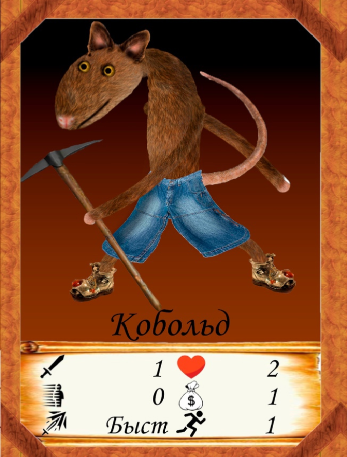

## **Idea**
We are going to create a website where people can play the board game "Battle of Weakness" (one-on-one turn-based strategy).
We will need to create a web version of the game and create a list of rules. Also create the ability for users to register on the site so that they can play not only with friends (perhaps we will add a rating system). We also plan to add an achievement system on the site (by type: play 10 times, win 3 times, etc.)

## **Team**
*Polyachkov Dmitry* and *Kozubenko Andrew* - Backend developers  
*Svetlana Yakutina* and *Nikita Volkov* - Frontend developers  
*22216 Group*

## **Implementation**
We will look for technical means for the implementation of this project in the process of studying the courses offered by CFT and also other sources of information
Most likely, the main backend development language will be java and fontend JS.

## **Difficulty**
The main difficulty in solving this problem will be that we have never written websites, and we will study this area from scratch, which will significantly slow down development  
The second challenge will be implementing user interaction. Graphics, sounds and other visual improvements, because to implement this you will have to face a huge number of problems and technologies.

## **What we want**
At the end of the project, we want to see a website where you can play our game, track your progress, compete with friends and other people from all over the world

## **And some spoilers...**

